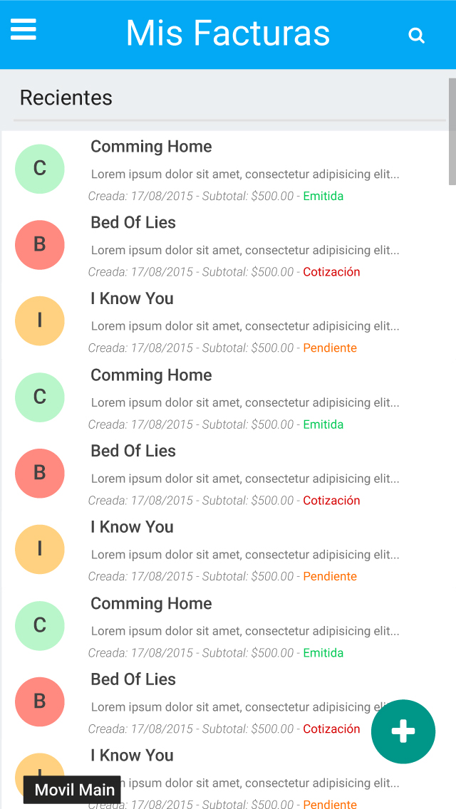
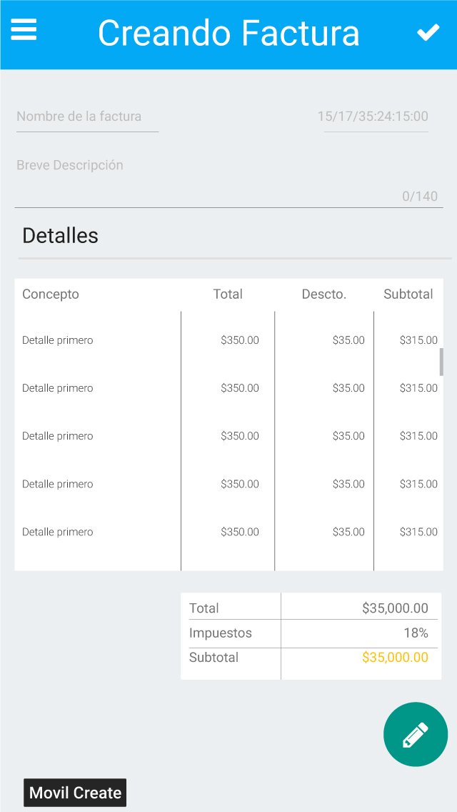

#Fact App
## Aplicacion de Facturacion y Cotizacion

Como **freelancers** nuestros clientes se acercan a nosotros y desan una vista más detallada de lo
que hacemos y cómo lo hacemos, cuál es nuestro proceso y como nos organizamos, por qué nuestra
factura es tan elevada (solo relativamente), si no hacemos *"nada"*. Bueno eso no es del todo cierto.

Algo que habla por si mismo y que resalta nuestra identidad, son nuestras cuentas; como las manejamos
y como las mostramos a venido a ser algo de suma importancia.

Con **FactApp** (debemos buscar un mejor nombre), todo esto queda de lado haciendo super facil el darle
a nuestros clientes una factura o cotizacion más responsable. No solamente eso, sino que se nos hace
más facil el llevar el control de nuestros proyectos, pagos e ingresos.

## Aun en face BETA :disappointed:
Si, es solo un proyecto que a penas inicia, pero será grande. Por ahora el proyecto está en este
commit en blanco practicamente.

#¿Qué puedo esperar?
* Una aplicacion en tiempo real es lo que se está construyendo aquí. Con herramientas como [firebase](http://firebase.io)
y AngularJs, todas nuestras cuentas estarán sincronizadas en las nubes y serán actualizadas en tiempo
real en todos nuestros dispositivos

* SelfHosted: Solo descarga y pon a correr tu servidor, y listo; tu app será tuya y solo tuya.

Y mucho más en camino

## ¿Hay imagenes?
Dentro de la carpeta [app](app/images/mockup) tenemos algunas, pero para que esperar:

